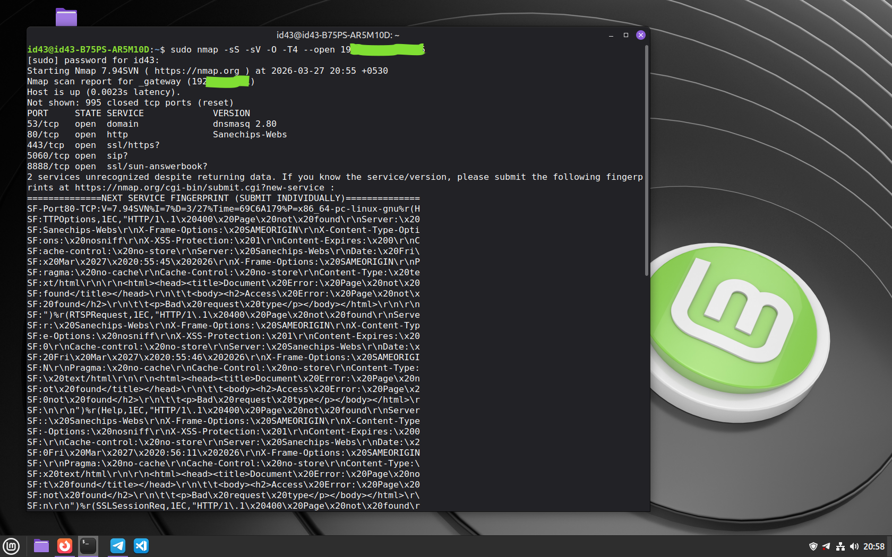
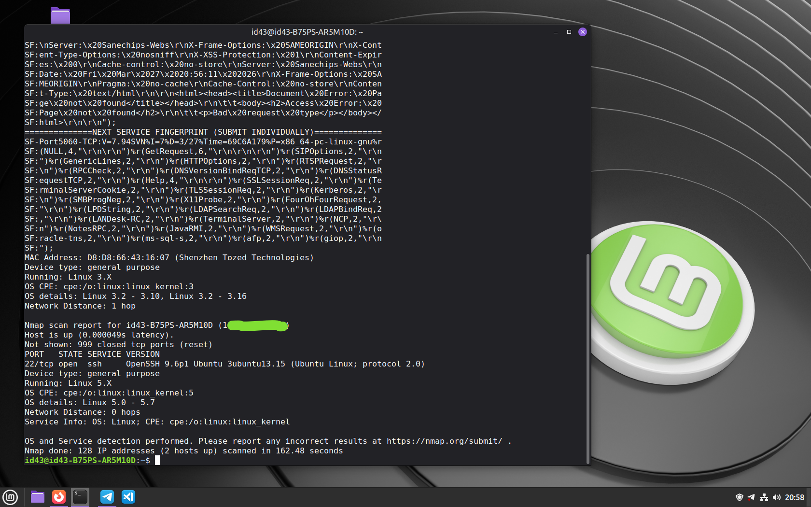

# Nmap Scan - Basic Network Discovery

## Objective
Scan my local network to identify active devices and open ports.

## Command Used
nmap 192.168.x.x/25

## What this does
- Scans all devices in the local network
- Shows which devices are active
- Displays open ports

## Sample Result (example)
- 192.168.x.1 → Router
- 192.168.x.15 → My PC

## What I learned
- What an IP range is
- How devices are discovered on a network
- Basics of open/closed ports

## Note
This scan was performed only on my own local network.

# Nmap Scan - Basic Network Discovery 🖥️

## Objective
Scan my local network to identify active devices and open ports.

## Command Used
nmap 192.168.x.x/25

## Screenshot

*Screenshot shows a successful network mapping using a TCP SYN (Stealth) scan. The scan identifies service versions and performs OS detection using aggressive timing (-T4), filtering the output to display only open ports.*
