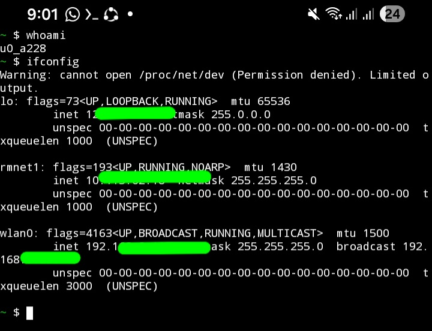
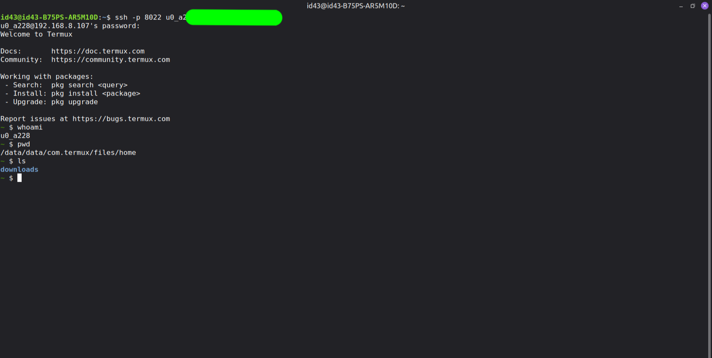
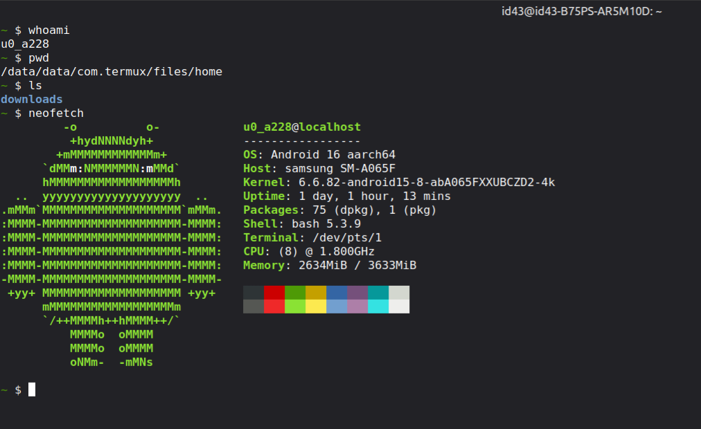

# 1 - SSH Setup (Linux Server to Android Termux Client) 

## Objective
Connect my Android device (Termux) to my PC using SSH.

## Steps
1. Installed SSH on PC
2. Found PC IP address using `ip a`
3. Started SSH service:  
   `sudo systemctl start ssh`
4. Connected from Termux:  
   `ssh username@192.168.x.x`

## Problem
Connection failed initially because SSH service was not running.

## Solution
Started SSH service and retried.

## What I learned
- How SSH works  
- Importance of open ports (port 22)  
- Basic client-server communication

## Screenshot

*Screenshot shows a successful SSH connection from PC to Termux.*

# 2 - SSH Setup (Android Termux Server to Linux Client)

## Objective
Connect from my Linux PC to my Android device running Termux using SSH.

## Steps
1. Installed OpenSSH inside Termux: `pkg install openssh`pkg install openssh
2. Set a password: `passwd`
3. Checked Termux username: `whoami`
4. Found Android IP address: `ifconfig`
5. Connected from Linux PC: `ssh -p 8022 u0_a228@192.168.x.x`

## Screenshot
 

*Screenshot shows android mobile name and ifconfig to get smart phone ip address.*

## Screenshot
 

*Screenshot shows how I connected to my Android server via Linux terminal.*

## Screenshot
 

*Screenshot shows a successful SSH connection from Termux to PC.*
