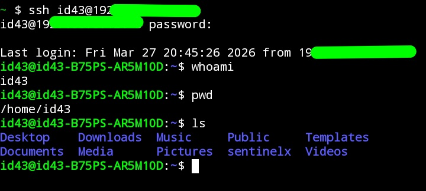

# SSH Setup (Termux to PC) 🔐

## Objective
Connect my Android device (Termux) to my PC using SSH.

## Steps
1. Installed SSH on PC
2. Found PC IP address using `ip a`
3. Started SSH service:  
   `sudo systemctl start ssh`
4. Connected from Termux:  
   `ssh username@192.168.x.x`

## Problem
Connection failed initially because SSH service was not running.

## Solution
Started SSH service and retried.

## What I learned
- How SSH works  
- Importance of open ports (port 22)  
- Basic client-server communication

## Screenshot

*Screenshot shows a successful SSH connection from Termux to PC.*
